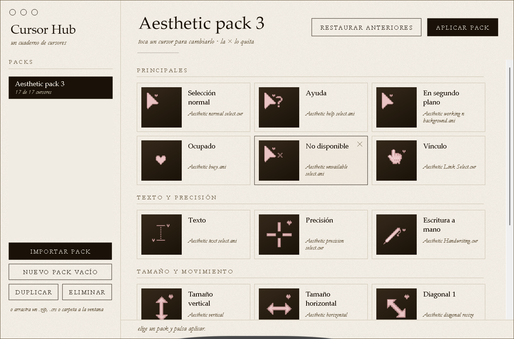

# Cursor Hub

Creado por **[@kisnner26](https://github.com/kisnner26)**.

Una app de escritorio para Windows: importa packs de cursores y aplícalos con un clic.

## Descarga

**[CursorHub.exe](https://github.com/kisnner26/cursor-hub/releases/latest/download/CursorHub.exe)**: un solo archivo, portable, sin instalación ni permisos de administrador. Como no está firmado, SmartScreen puede avisar: *Más información → Ejecutar de todos modos*.

## Qué hace

- **Importar packs**: arrastra un `.zip`, `.crs` o carpeta a la ventana. Si el pack trae `.crs` se asigna cada cursor exactamente; si no, se reconocen por el nombre del archivo.
- **Aplicar con un clic**: reemplaza tus cursores actuales (solo tu usuario).
- **Respaldo y restaurar**: la primera vez que aplicas guarda tus cursores; *Restaurar anteriores* los devuelve.
- **Editar por rol**: los 17 cursores de Windows agrupados por sección con vista previa; cambia o quita cualquiera y duplica packs para mezclarlos.

La biblioteca se guarda en `%LOCALAPPDATA%\CursorHub`.

## Compilar

Ejecuta `build.bat`. Usa el compilador de C# que ya trae Windows (.NET Framework 4.x); no hace falta instalar nada.

## Créditos

- Autor: **[@kisnner26](https://github.com/kisnner26)** (diseño, icono y código).

- Pack de ejemplo incluido: **Aesthetic pack <3** de **✧ • Skyler • ✧**, dominio público ([original](http://www.rw-designer.com/cursor-set/aesthetic-pack-3-not-completed)), completado en [aesthetic-pack-3-completed](https://github.com/kisnner26/aesthetic-pack-3-completed).
- Estética de cuaderno de bocetos basada en [creador-de-flores](https://github.com/kisnner26/creador-de-flores).
